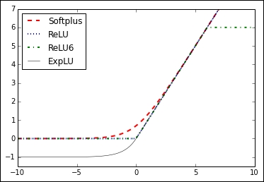
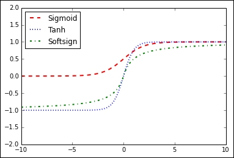

# 一、 TensorFlow 起步

## 工作方式

```py
# 转换和标准化数据
data = tf.nn.batch_norm_with_global_normalization(...)

# 将数据划分为训练、测试和验证集

# 设定超参数
# 分别是学习率、批量大小和迭代数
learning_rate = 0.01
batch_size = 100
iterations = 1000

# 初始化变量和占位符
a_var = tf.constant(42)
x_input = tf.placeholder(tf.float32, [None, input_size])
y_input = tf.placeholder(tf.float32, [None, num_classes])

# 定义模型结构
y_pred = tf.add(tf.mul(x_input, weight_matrix), b_matrix)

# 定义损失函数
loss = tf.reduce_mean(tf.square(y_actual – y_pred))

# 初始化和训练模型
# 就是用优化算法，找到使损失最小的参数
with tf.Session(graph=graph) as session:
  ...
  session.run(...)
  ...

# 可以这样来初始化图
session = tf.Session(graph=graph)
session.run(...)

# 评估模型

# 调优超参数

# 部署/预测新结果
```

## 声明张量

```py
# 常量

# 零填充的张量
zero_tsr = tf.zeros([row_dim, col_dim])

# 一填充的张量
ones_tsr = tf.ones([row_dim, col_dim])

# 常量填充的张量
filled_tsr = tf.fill([row_dim, col_dim], 42)

# 从现有常量创建张量
constant_tsr = tf.constant([1,2,3])

# 相似形状的张量

# 基于其它张量的形状创建张量
zeros_similar = tf.zeros_like(constant_tsr)
ones_similar = tf.ones_like(constant_tsr)

# 顺序张量

# 指定包含预定义间隔的张量
# 与 numpy 的 arange 和 linspace 很像
# 注意 linspace 包含停止值，range 不包含
linear_tsr = tf.linspace(start=0, stop=1, start=3)
integer_seq_tsr = tf.range(start=6, limit=15, delta=3)

# 随机张量

# 创建均匀分布的张量
# 值在 minval 和 maxval 之间，左闭右开
randunif_tsr = tf.random_uniform([row_dim, col_dim], minval=0, maxval=1)

# 创建正态分布的张量
randnorm_tsr = tf.random_normal([row_dim, col_dim], mean=0.0, stddev=1.0)

# 创建截断正态分布的张量
# 值在两个标准差范围内
runcnorm_tsr = tf.truncated_normal([row_dim, col_dim], mean=0.0, stddev=1.0)

# random_shuffle 沿第一维打乱
shuffled_output = tf.random_shuffle(input_tensor)
# random_crop 用于随机截断图像
cropped_output = tf.random_crop(input_tensor, crop_size)
# 将三通道图像的长宽截断一半
cropped_image = tf.random_crop(my_image, [height/2, width/2, 3])

# 一旦定义了常量
# 就可以把它包在 Variable 中来创建变量
my_var = tf.Variable(tf.zeros([row_dim, col_dim]))
```

## 占位符和变量

```py
# 用 Variable 函数创建变量
# 它接受张量，作为变量的初值
my_var = tf.Variable(tf.zeros([2,3]))
sess = tf.Session()
# 还需要初始化变量，就是把变量放在图上
initialize_op = tf.global_variables_initializer ()
sess.run(initialize_op)

# 占位符在图上为变量占位置
# 它的数据从 feed_dict 获得
sess = tf.Session()
# 将 x, y 创建为占位符
x = tf.placeholder(tf.float32, shape=[2,2])
y = tf.identity(x)
x_vals = np.random.rand(2,2)
# 向 x 提供值
sess.run(y, feed_dict={x: x_vals})
# 要注意 sess.run(x, feed_dict={x: x_vals}) 会产生自引用错误

# 可以用一个操作初始化所有变量
initializer_op = tf.global_variables_initializer ()

# 但是可以指定变量初始化的顺序
sess = tf.Session()
first_var = tf.Variable(tf.zeros([2,3]))
sess.run(first_var.initializer)
second_var = tf.Variable(tf.zeros_like(first_var))
# 依赖于 first_var
sess.run(second_var.initializer)
```

## 处理矩阵

```py
# 导入 TF，创建会话
import tensorflow as tf
sess = tf.Session()

# 创建矩阵
identity_matrix = tf.diag([1.0, 1.0, 1.0])
A = tf.truncated_normal([2, 3])
B = tf.fill([2,3], 5.0)
C = tf.random_uniform([3,2])
D = tf.convert_to_tensor(np.array([[1., 2., 3.],[-3., -7., -1.],[0., 5., -2.]]))
print(sess.run(identity_matrix))
'''
[[ 1.  0.  0.]
 [ 0.  1.  0.]
 [ 0.  0.  1.]]
'''
print(sess.run(A))
'''
[[ 0.96751703  0.11397751 -0.3438891 ]
 [-0.10132604 -0.8432678   0.29810596]]
'''
print(sess.run(B))
'''
[[ 5.  5.  5.]
 [ 5.  5.  5.]]
'''

# 使用函数（或者运算符）计算加和减
print(sess.run(A+B))
'''
[[ 4.61596632  5.39771316  4.4325695 ]
 [ 3.26702736  5.14477345  4.98265553]]
'''
print(sess.run(B-B))
'''
[[ 0.  0.  0.]
 [ 0.  0.  0.]]
'''
# 矩阵乘法（@ 运算符）
print(sess.run(tf.matmul(B, identity_matrix)))
'''
[[ 5.  5.  5.]
 [ 5.  5.  5.]]
'''

# 转置
print(sess.run(tf.transpose(C)))
'''
[[ 0.67124544  0.26766731  0.99068872]
 [ 0.25006068  0.86560275  0.58411312]]
'''

# 如果重新 run，随机张量会提供不同的值

# 行列式
print(sess.run(tf.matrix_determinant(D)))
# -38.0

# 逆
print(sess.run(tf.matrix_inverse(D)))
'''
[[-0.5        -0.5        -0.5       ]
 [ 0.15789474  0.05263158  0.21052632]
 [ 0.39473684  0.13157895  0.02631579]] 
'''

# cholesky 分解
print(sess.run(tf.cholesky(identity_matrix)))
'''
[[ 1.  0.  1.]
 [ 0.  1.  0.]
 [ 0.  0.  1.]]
'''

# 特征值分解
# 一行一个特征向量
print(sess.run(tf.self_adjoint_eig(D))
'''
[[-10.65907521  -0.22750691   2.88658212]
 [  0.21749542   0.63250104  -0.74339638]
 [  0.84526515   0.2587998    0.46749277]
 [ -0.4880805    0.73004459   0.47834331]]
'''
```

## 定义运算

# div 是 Py2 的除法（/）
# 整数除以整数是整数
# truediv 是 Py3 的除法（/）
# 整数除以整数是浮点
print(sess.run(tf.div(3,4)))
# 0
print(sess.run(tf.truediv(3,4)))
# 0.75

# floordiv 是取整除法（//）
print(sess.run(tf.floordiv(3.0,4.0)))
# 0.0

# 余数
print(sess.run(tf.mod(22.0, 5.0)))
# 2.0-

# 叉乘
# 只接受三维向量（一维三元素张量）
print(sess.run(tf.cross([1., 0., 0.], [0., 1., 0.])))
# [ 0.  0.  1.0]

# 可以拿 sin 和 cos 组成 tan
# （tan(pi/4)=1）
print(sess.run(tf.div(tf.sin(3.1416/4.), tf.cos(3.1416/4.))))
# 1.0

# 定义复杂的多项式函数
def custom_polynomial(value):
    return(tf.sub(3 * tf.square(value), value) + 10)
print(sess.run(custom_polynomial(11)))
# 362
```

## 激活函数

```py
# ReLU 函数（max(0,x)）
print(sess.run(tf.nn.relu([-3., 3., 10.])))
# [  0.  3.  10.]

# ReLU6 是 min(max(0,x),6)
# 它是硬直的 sigmoid
# 并且不受梯度消失和爆炸影响
# 在 CNN 中很有用
print(sess.run(tf.nn.relu6([-3., 3., 10.])))
# [ 0.  3.  6.]

# Sigmoid 是 1/(1+exp(-x))
# 光滑函数
print(sess.run(tf.nn.sigmoid([-1., 0., 1.])))
# [ 0.26894143  0.5         0.7310586 ]

# tanh 是另一个光滑函数
# 值为 -1 ~ 1 而不是 0 ~ 1
print(sess.run(tf.nn.tanh([-1., 0., 1.])))
# [-0.76159418  0.         0.76159418 ]

# softsign 是 x/(abs(x) + 1)
# 是 sign 的连续近似
print(sess.run(tf.nn.softsign([-1., 0., -1.])))
# [-0.5  0.   0.5]

# softplus 是 log(exp(x) + 1)
# 是 ReLU 的光滑版本
print(sess.run(tf.nn.softplus([-1., 0., -1.])))
# [ 0.31326166  0.69314718  1.31326163]

# ELU 是 exp(x)-1, x < 0 和 x, x > 0
# 类似于 softplus 但是最小值为 1
print(sess.run(tf.nn.elu([-1., 0., -1.])))
# [-0.63212055  0.          1.        ]
```





## 使用数据集

```py
# 鸢尾花数据集
# 三个品种（山、杂色、弗吉尼亚）
# 150 个数据，每种 50 个
# 四个特征：萼片长宽、花瓣长宽
from sklearn import datasets
iris = datasets.load_iris()
print(len(iris.data))
# 150
print(len(iris.target))
# 150
print(iris.target[0]) # Sepal length, Sepal width, Petal length, Petal width
# [ 5.1 3.5 1.4 0.2]
print(set(iris.target)) # I. setosa, I. virginica, I. versicolor
# {0, 1, 2}

# 出生体重数据集
# 189 个数据，11 个变量
import requests
birthdata_url = 'https://www.umass.edu/statdata/statdata/data/lowbwt.dat'
birth_file = requests.get(birthdata_url)
birth_data = birth_file.text.split('\'r\n') [5:]
birth_header = [x for x in birth_data[0].split( '') if len(x)>=1]
birth_data = [[float(x) for x in y.split( ')'' if len(x)>=1] for y in birth_data[1:] if len(y)>=1]
print(len(birth_data))
# 189
print(len(birth_data[0]))
# 11

# 波士顿住房数据集
# 506 个数据，14 个变量
# sklearn 自带，当然直接从网站下载也可以
import requests
housing_url = 'https://archive.ics.uci.edu/ml/machine-learning-databases/housing/housing.data'
housing_header = ['CRIM', 'ZN', 'INDUS', 'CHAS', 'NOX', 'RM', 'AGE', 'DIS', 'RAD', 'TAX', 'PTRATIO', 'B', 'LSTAT', 'MEDV0']
housing_file = requests.get(housing_url)
housing_data = [[float(x) for x in y.split( '') if len(x)>=1] for y in housing_file.text.split('\n') if len(y)>=1]
print(len(housing_data))
# 506
print(len(housing_data[0]))
# 14

# MNIST 手写数字数据集
# 包含手写数字 0~9 的 70000 章图片
# 60000 个带标签，10000 个不带标签
from tensorflow.examples.tutorials.mnist import input_data
mnist = input_data.read_data_sets("MNIST_data/"," one_hot=True)
print(len(mnist.train.images))
# 55000
print(len(mnist.test.images))
# 10000
print(len(mnist.validation.images))
# 5000
print(mnist.train.labels[1,:]) # The first label is a 3'''
# [ 0.  0.  0.  1.  0.  0.  0.  0.  0.  0.]

# 垃圾文本数据集
import requests
import io
from zipfile import ZipFile
zip_url = 'http://archive.ics.uci.edu/ml/machine-learning-databases/00228/smsspamcollection.zip'
r = requests.get(zip_url)
z = ZipFile(io.BytesIO(r.content))
file = z.read('SMSSpamCollection')
text_data = file.decode()
text_data = text_data.encode('ascii',errors='ignore')
text_data = text_data.decode().split(\n')
text_data = [x.split(\t') for x in text_data if len(x)>=1]
[text_data_target, text_data_train] = [list(x) for x 

# 电影评论数据集
import requests
import io
import tarfile
movie_data_url = 'http://www.cs.cornell.edu/people/pabo/movie-review-data/rt-polaritydata.tar.gz'
r = requests.get(movie_data_url)
# Stream data into temp object
stream_data = io.BytesIO(r.content)
tmp = io.BytesIO()
while True:
    s = stream_data.read(16384)
    if not s:
        break
    tmp.write(s)
stream_data.close()
tmp.seek(0)
# Extract tar file
tar_file = 

# CIFAR-10 数据集
# 包含 60000 带标签的彩色图像（32x32）
# 10 个分类（飞机、摩托车、鸟等等）
# 50000 个训练样本，10000 个测试样本
# 由于它太大了，请直接从官网下载：
# http://www.cs.toronto.edu/~kriz/cifar.html

# 莎士比亚的作品
# 来源于大名鼎鼎的古登堡项目
import requests
shakespeare_url = 'http://www.gutenberg.org/cache/epub/100/pg100.txt'
# Get Shakespeare text
response = requests.get(shakespeare_url)
shakespeare_file = response.content
# Decode binary into string
shakespeare_text = shakespeare_file.decode('utf-8')
# Drop first few descriptive paragraphs.
shakespeare_text = shakespeare_text[7675:]
print(len(shakespeare_text)) # Number of characters
# 5582212

# 英语德语翻译数据集
# 由 Tatoeba 项目发布
# ManyThings.org 编译了句子到句子的翻译
import requests
import io
from zipfile import ZipFile
sentence_url = 'http://www.manythings.org/anki/deu-eng.zip'
r = requests.get(sentence_url)
z = ZipFile(io.BytesIO(r.content))
file = z.read('deu.txt''')
# Format Data
eng_ger_data = file.decode()
eng_ger_data = eng_ger_data.encode('ascii''',errors='ignore''')
eng_ger_data = eng_ger_data.decode().split(\n''')
eng_ger_data = [x.split(\t''') for x in eng_ger_data if len(x)>=1]
[english_sentence, german_sentence] = [list(x) for x in zip(*eng_ger_data)]
```

## 附加资源

+   [官方 API 指南](https://tensorflow.google.cn/api_docs/python)
+   [官方教程](https://tensorflow.google.cn/tutorials/index.html)
+   [Github 仓库](https://github.com/tensorflow/tensorflow)
+   [包含 TF 的 Docker 容器](https://hub.docker.com/r/tensorflow/tensorflow/)
+   [包含 TF 的虚拟机](https://docs.google.com/forms/d/1mUztUlK6_z31BbMW5ihXaYHlhBcbDd94mERe-8XHyoI/viewform)
+   [VMWare 下载](https://www.vmware.com/go/downloadplayer/)
+   [SO 的 TF 讨论区](http://stackoverflow.com/questions/tagged/Tensorflow)
+   [Udacity 的深度学习课程](https://www.udacity.com/course/deep-learning--ud730)
+   [TF PlayGround](http://playground.tensorflow.org/)
+   [Coursera 上的 Hinton 的课程](https://www.coursera.org/learn/neural-networks)
+   [斯坦福 CS231n](http://cs231n.stanford.edu/)
